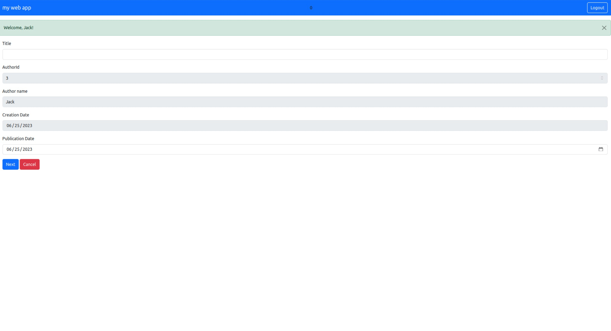
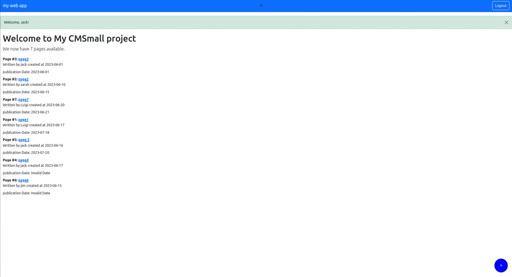

# Exam #1: "CMSmall"
## Student: s309262 RAHIMI ZADEH NASRIN 

## React Client Application Routes

- Route `/`: shows the list of all pages two different view for back-office and front-office
- Route `/pages/:pageId`: show the detailed properties of specific page it has different view for admins + author of the page , not athour + not logged in users
- Route `/addPage` : with this route logged in users can add a page by the use of pageForm
- Route `pages/:pageId/editpage`:with this logged in users go to the page form (normal users can only edit thier own page) and change title, publication date and admins can also choose a different author for the page
- Route `/pages/:pageId/editblocks: with this route we go to blocksForm where we can perform all the requiered actions
- Route `addPage/:pageId/addblocks` similar to the edit block route
- Route `edit-website-name`: redirect the admin users to WebsiteNameForm where they can change the name of the web site
- Route `*`: not found route
- Route `/login` : handles the login process

## API Server

POST /api/sessions
request parameters: None
request body content: None
response body content: JSON object containing user information if authentication is successful, or an error message if authentication fails

GET /api/sessions/current
request parameters: None
response body content: JSON object containing the current authenticated user's information if the user is authenticated, or an error message if the user is not authenticated

DELETE /api/sessions/current
request parameters: None
response body content: None

GET /api/users
request parameters: None
response body content: JSON array of user objects

GET /api/pagename
request parameters: None
response body content: JSON object containing the name of the website

PUT /api/pagename
request parameters: None
request body content: JSON object with a "name" property
response body content: JSON object with a success message if the website name is updated successfully, or an error message if the update fails

GET /api/pages
request parameters: None
response body content: JSON array of page objects

GET /api/pages/:id
request parameters: id (page ID)
response body content: JSON object representing the requested page

GET /api/pages/:id/blocks
request parameters: id (page ID)
response body content: JSON array of block objects associated with the page, including the corresponding image if the block type is "image"

DELETE /api/pages/:id
request parameters: id (page ID)
response body content: JSON object with a success message if the page is deleted successfully, or an error message if the deletion fails

POST /api/pages/addPage
request parameters: None
request body content: JSON object with properties "title", "authorId", "author", "creationDate", "publicationDate"
response body content: JSON object with the ID of the newly added page if the addition is successful, or an error message if the addition fails

PUT /api/pages/:pageId/updatePage
request parameters: pageId (page ID)
request body content: JSON object with properties "title", "authorId", "author", "creationDate", "publicationDate"
response body content: JSON object with a success message if the page is updated successfully, or an error message if the update fails

DELETE /api/pages/:id/blocks
request parameters: id (page ID)
response body content: JSON object with a success message if the blocks are deleted successfully, or an error message if the deletion fails

POST /api/pages/:id/blocks
request parameters: id (page ID)
request body content: JSON object with properties "type", "context", "imageId", "order"
response body content: JSON object with the ID of the newly added block if the addition is successful, or an error message if the addition fails

GET /api/pages/:id/blocksonly
request parameters: id (page ID)
response body content: JSON array of block objects associated with the page (excluding image information)

## Database Tables

- Table `users` - contains id, username, password, isAdmin, name, salt
- Table `pages` - contains id, title, authorId, author, creationDate, publicationDate
- Table `blocks` - contains id, pageId, type, context, imageId, order
- Table `images` - contains id, name, imageUrl
- Table `website` - contains id, webname

## Main React Components

- `AuthComponents`: contains LoginForm and LogoutButton and here I handle login and logout
  
- `Block components: this component handle the creation deletion ordering modifications of the blocks of a page
  
- `EditNameForm`: containswebsiteNameForm and handles the modification of the website's name
  
- `NavbarComponents` : contains NavHeader and handle the navigationbar. the login/logout and edit website name are here
  
- `NotFoundComponents`: when the route is not found
  
- `PageForm` : handles the creation and modification of page details
  
- `PageListComponent`: handles the appearance of all the pages for both back-office and front-office
  
- `SinglePageComponent`: show the details of a single page and it's block. here authorized users can delete page modify page and it's blocks

## Screenshot

## Users Credentials

- Nasrin@polito.it, 4321 (isAdmin)
- luigi@polito.it, testtest (isAdmin)
- jack@polito.it, 1111 
- sarah@polito.it, 2222
- ted@polito.it, 3333
- jim@polito.it, 4444
